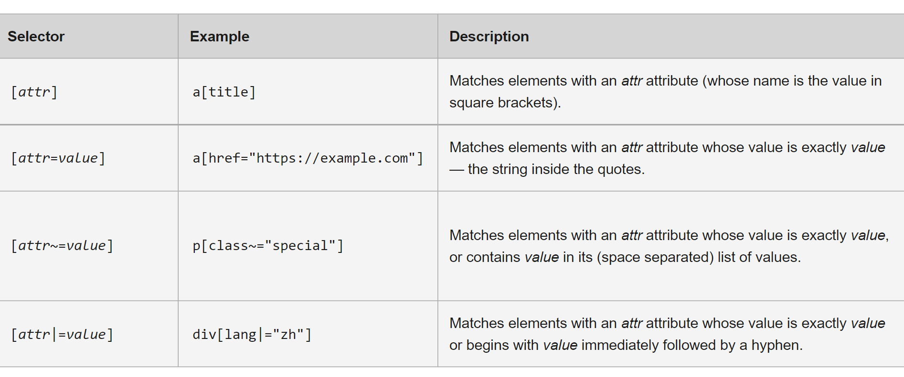
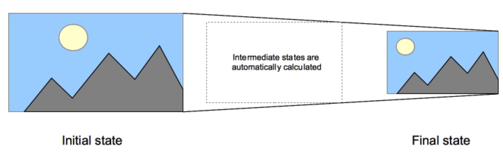

# 01- JavaScript Drum Kit Concepts

## keycode.info : https://keycode.info/


## data-key
- HTML5 is designed with extensibility in mind for data that should be associated with a particular element but need not have any defined meaning. 
- data-* attributes allow us to store extra information on standard, semantic HTML elements without other hacks such as non-standard attributes, or extra properties on DOM.

> Example:

```
<audio data-key="65" src="sounds/clap.wav"></audio>
```

## Audio
- The HTMLMediaElement interface's currentTime property specifies the current playback time in seconds.
Changing the value of currentTime seeks the media to the new time.

> Syntax:
```
var currentTime = htmlMediaElement.currentTime;
htmlMediaElement.currentTime = 35;
```

### Value
- A double-precision floating-point value indicating the current playback time in seconds.
- If the media is not yet playing, the value of currentTime indicates the time position within the media at which playback will begin once the **play ()** method is called.
- Setting currentTime to a new value seeks the media to the given time, if the media is available.

## kbd
- The `<kbd>` tag is used to define keyboard input.
- The content inside is displayed in the browser's default monospace font.


## Window.addEventListener
- The `addEventListener()` method of the window interface sets up a function that will be called whenever the specified event is delivered to the target.

## Keydown event 
- The `keydown` event is fired when a key is pressed.

    

## Attribute selector in js `.key[data-key="${e.keyCode}"]`
- These selectors enable the selection of an element based on the presence of an attribute alone (for example href), or on various different matches against the value of the attribute.

    


## .classList.add() and .classList.remove()
- The **Element.classList** is a read-only property that returns a live DOMTokenList collection of the class attributes of the element. This can then be used to manipulate the class list.
- The `add()` method of the DOMTokenList interface adds the given tokens to the list.
> Syntax :<br> add(token);<br>
where parameter is a string representing a token (or tokens) to add to the DOMTokenList.
- The `remove()` method of the DOMTokenList interface removes the specified tokens from the list.
> Syntax :<br>remove(token);<br>
where parameter is a string representing the token you want to remove from the list. If the string is not in the list, no error is thrown, and nothing happens.

## forEach
- The `forEach()` method executes a provided function once for each array element.
- `forEach()` calls a provided callbackFn function once for each element in an array in ascending index order.
- callbackFn is invoked with three arguments:
    - the value of the element
    - the index of the element
    - the Array object being traversed

## this
> Syntax : this
- A property of an execution context (global, function or eval) that, in non–strict mode, is always a reference to an object and in strict mode can be any value.


# Css:

## Transition
- `CSS transitions` provide a way to control animation speed when changing CSS properties
- Instead of having property changes take effect immediately, you can cause the changes in a property to take place over a period of time. 
> For example, if you change the color of an element from white to black, usually the change is instantaneous. With CSS transitions enabled, changes occur at time intervals that follow an acceleration curve, all of which can be customized.
- Animations that involve transitioning between two states are often called implicit transitions as the states in between the start and final states are implicitly defined by the browser.

    

## Transitioned end event
- The `transitionend event` is fired when a CSS transition has completed.
- The transitionend event is fired in both directions - as it finishes transitioning to the transitioned state, and when it fully reverts to the default or non-transitioned state.
- If there is no transition delay or duration, if both are 0s or neither is declared, there is no transition, and none of the transition events are fired.


## Know more: 

- [Attribute Selectors](https://developer.mozilla.org/en-US/docs/Learn/CSS/Building_blocks/Selectors/Attribute_selectors)

- [CSS Transitions](https://developer.mozilla.org/en-US/docs/Web/CSS/CSS_Transitions/Using_CSS_transitions)

- [Transition End event](https://developer.mozilla.org/en-US/docs/Web/API/HTMLElement/transitionend_event)

- [classList](https://developer.mozilla.org/en-US/docs/Web/API/Element/classList)

- [Keydown Event](https://developer.mozilla.org/en-US/docs/Web/API/Document/keydown_event)

- [currentTime](https://developer.mozilla.org/en-US/docs/Web/API/HTMLMediaElement/currentTime)

