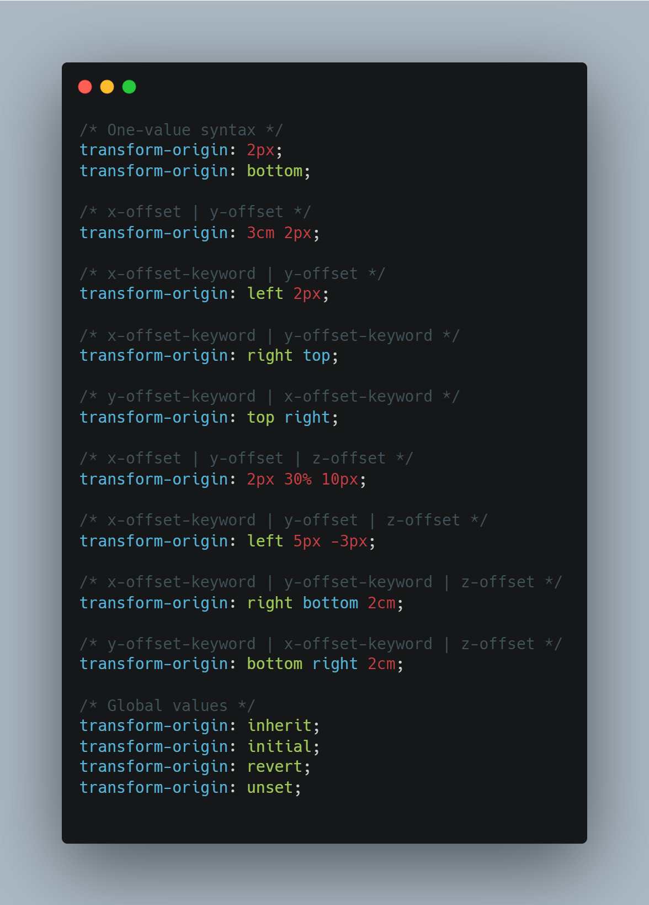
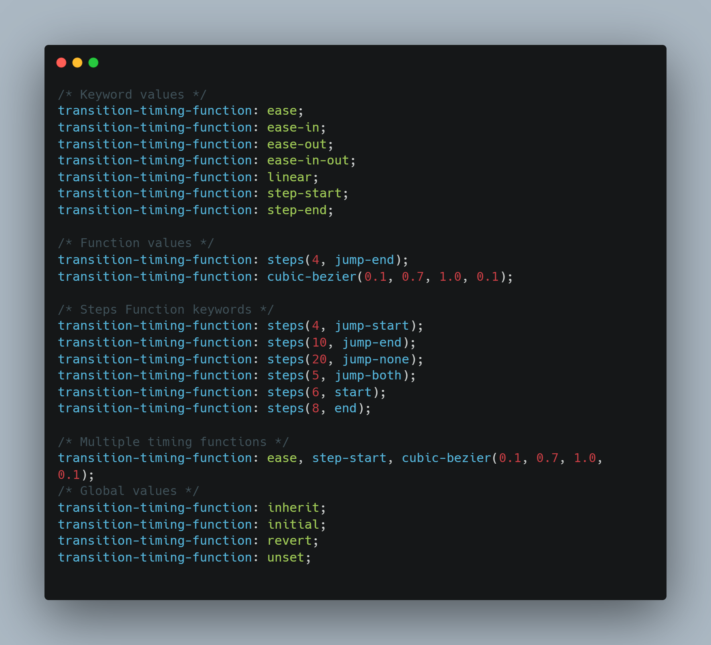

# **02- CSS + JS - Clock**

# JS
## setInterval
- The` setInterval()` method, offered on the **Window** and **Worker** interfaces, repeatedly calls a function or executes a code snippet, with a fixed time delay between each call.

> Syntax:
```
var intervalID = setInterval(func, [delay, arg1, arg2, ...]);
var intervalID = setInterval(function[, delay]);
var intervalID = setInterval(code, [delay]);
```


## Date
- JavaScript `Date` objects represent a single moment in time in a platform-independent format.
- Date objects contain a Number that represents milliseconds 

Syntax :
```
new Date()
When called as a constructor, returns a new Date object.
```
#### `.getSeconds()`
- Returns the **seconds** (0–59) in the specified date according to local time.

#### `.getMinutes()`
- Returns the **minutes** (0–59) in the specified date according to local time.

#### `.getHours()`
- Returns the **hour** (0–23) in the specified date according to local time.
<br>
</br>

# CSS
## Transform- rotate
- The `rotate()` CSS function defines a transformation that rotates an element around a fixed point on the 2D plane, without deforming it. Its result is a `<transform-function>` data type.
- The fixed point that the element rotates around — mentioned above — is also known as the transform origin. This defaults to the center of the element, but you can set your own custom transform origin using the transform-origin property.
> Syntax :
```
rotate(a)
```
## Transform-origin
- The `transform-origin CSS` property sets the origin for an element's transformations.
- The `transform origin` is the point around which a transformation is applied. 
- For **example**, the transform origin of the rotate() function is the center of rotation.
- The `transform-origin` property may be specified using one, two, or three values, where each value represents an offset.
- Syntax :

    


## Transition-timing-function
- The `transition-timing-function` CSS property sets how intermediate values are calculated for CSS properties being affected by a transition effect.

- Syntax :

    


## Know more
- [Date](https://developer.mozilla.org/en-US/docs/Web/JavaScript/Reference/Global_Objects/Date)
- [transform-origin](https://developer.mozilla.org/en-US/docs/Web/CSS/transform-origin)
- [transform-rotate](https://developer.mozilla.org/en-US/docs/Web/CSS/transform-function/rotate())
- [transition-timing-function](https://developer.mozilla.org/en-US/docs/Web/CSS/transition-timing-function)
