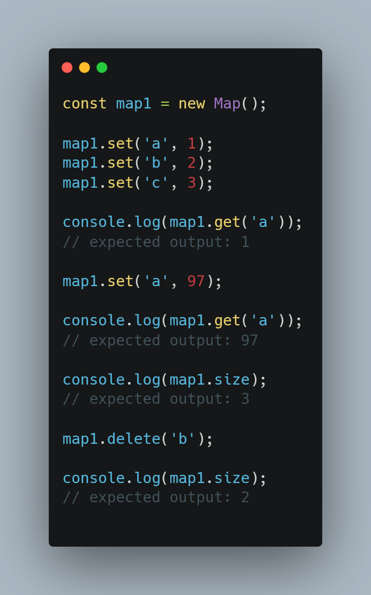

# 04 - Array Cardio Day 1
## Filter()
- The filter() method creates a new array with all elements that pass the test implemented by the provided function.

- Syntax:

    </img>

- Example:

   </img>


## console.table()
- The console.table() method displays tabular data as a table.
- This function takes one mandatory argument data, which must be an array or an object, and one additional optional parameter columns.
- It logs data as a table. Each element in the array (or enumerable property if data is an object) will be a row in the table.
- The first column in the table will be labeled (index). If data is an array, then its values will be the array indices. If data is an object, then its values will be the property names.
- Syntax :
```
console.table(data);
console.table(data, columns);
```
- Parameters
    - **data**
        - The data to display. This must be either an array or an object.
    - **columns**
        - An array containing the names of columns to include in the output.
- Example:

    </img>
 

## map()
- The Map object holds key-value pairs and remembers the original insertion order of the keys. Any value (both objects and primitive values) may be used as either a key or a value.

- Example:

    </img>


## sort() 
- The sort() method sorts the elements of an array in place and returns the sorted array.
- Default sort order is ascending.

- Syntax

    </img>

- Example:

    </img>


## reduce()
- The reduce() method executes a user-supplied “reducer” callback function on each element of the array, in order, passing in the return value from the calculation on the preceding element. The final result of running the reducer across all elements of the array is a single value.

- Syntax:

    </img>

- Example

    </img>


## Know more 

[console.table()](https://developer.mozilla.org/en-US/docs/Web/API/console/table)

[filter](https://developer.mozilla.org/en-US/docs/Web/JavaScript/Reference/Global_Objects/Array/filter)

[map](https://developer.mozilla.org/en-US/docs/Web/JavaScript/Reference/Global_Objects/Map)

[sort](https://developer.mozilla.org/en-US/docs/Web/JavaScript/Reference/Global_Objects/Array/sort)

[reduce](https://developer.mozilla.org/en-US/docs/Web/JavaScript/Reference/Global_Objects/Array/Reduce)
