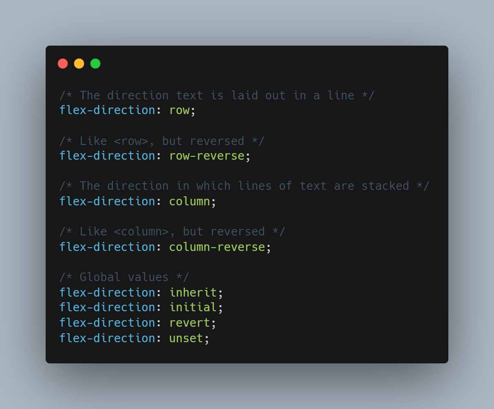

# 05 - Flex Panels Image Gallery

[Flexbox.io](https://flexbox.io/)


[Flexbox](https://developer.mozilla.org/en-US/docs/Web/CSS/CSS_Flexible_Box_Layout/Basic_Concepts_of_Flexbox)

## Cubic bezier:
- The `cubic-bezier()` function defines a Cubic Bezier curve.
- A Cubic Bezier curve is defined by four points P0, P1, P2, and P3. P0 and P3 are the start and the end of the curve and, in CSS these points are fixed as the coordinates are ratios. P0 is (0, 0) and represents the initial time and the initial state, P3 is (1, 1) and represents the final time and the final state.
- The cubic-bezier() function can be used with the animation-timing-function property and the transition-timing-function property. 
> Syntax:
```
cubic-bezier(x1,y1,x2,y2)
```

## Flex-direction:
- The `flex-direction` CSS property sets how flex items are placed in the flex container defining the main axis and the direction (normal or reversed).

- Syntax:

    


## classList.toggle:
- The `toggle()` method of the DOMTokenList interface removes an existing token from the list and returns false. If the token doesn't exist it's added and the function returns true.
> Syntax:
```
toggle(token);
toggle(token, force);
```
- Parameters
    - `token`
        - A string representing the token you want to toggle.

    - `force Optional`
        - If included, turns the toggle into a one way-only operation. If set to false, then token will only be removed, but not added. If set to true, then token will only be added, but not removed.


Know more

[Basic Concepts of Flexbox](https://developer.mozilla.org/en-US/docs/Web/CSS/CSS_Flexible_Box_Layout/Basic_Concepts_of_Flexbox)

[toggle](https://developer.mozilla.org/en-US/docs/Web/API/DOMTokenList/toggle)

[cubic-bezier](https://www.w3schools.com/cssref/func_cubic-bezier.asp)
