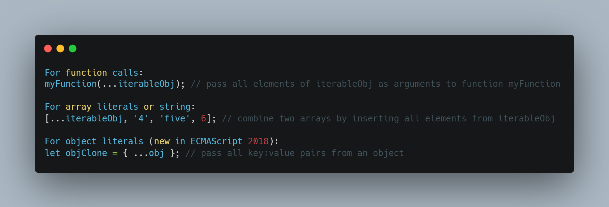
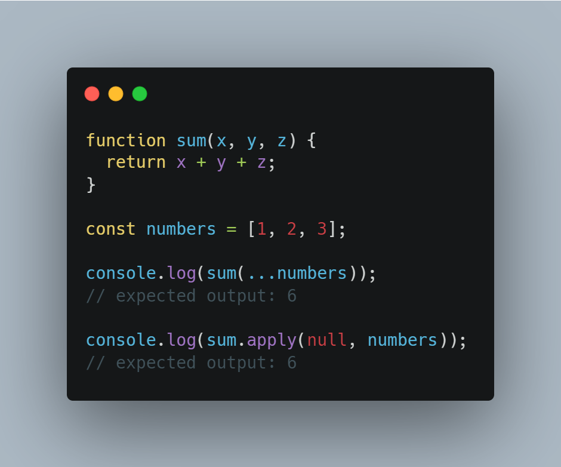
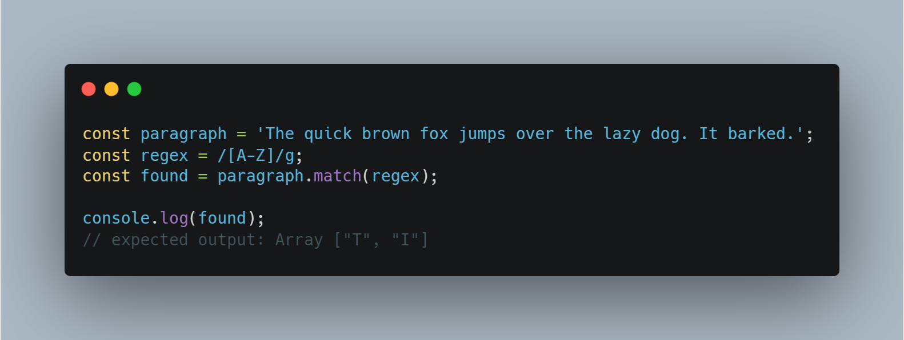

# 06 - Ajax Type Ahead

[Fetch](https://developer.mozilla.org/en-US/docs/Web/API/Fetch_API/Using_Fetch)

## Promise
- The **`Promise`** object represents the eventual completion (or failure) of an asynchronous operation and its resulting value.
- A Promise is a proxy for a value not necessarily known when the promise is created. 
- It allows you to associate handlers with an asynchronous action's eventual success value or failure reason. This lets asynchronous methods return values like synchronous methods: instead of immediately returning the final value, the asynchronous method returns a promise to supply the value at some point in the future.
- A `Promise` is in one of these states:
    - `pending` : initial state, neither fulfilled nor rejected.
    - `fulfilled` : meaning that the operation was completed successfully.
    - `rejected` : meaning that the operation failed.
- A pending promise can either be fulfilled with a value or rejected with a reason (error).

## Spread
- **`Spread`** syntax (...) allows an iterable such as an array expression or string to be expanded in places where zero or more arguments (for function calls) or elements (for array literals) are expected, or an object expression to be expanded in places where zero or more key-value pairs (for object literals) are expected.

- Syntax :

    </img>


- Example :

    </img>


## match()
- The **`match()`** method retrieves the result of matching a string against a regular expression.

- Syntax :
    ```
    match(regexp)
    ```

- Example :

    </img>


## Keyup:
- The **`keyup`** event is fired when a key is released.

- The keydown and keyup events provide a code indicating which key is pressed, while keypress indicates which character was entered. 
For example, a lowercase "a" will be reported as 65 by keydown and keyup, but as 97 by keypress. An uppercase "A" is reported as 65 by all events.


## Regular expression
- **`Regular expressions`** are patterns used to match character combinations in strings. 
- In JavaScript, regular expressions are also objects. 
 -These patterns are used with the exec() and test() methods of RegExp, and with the match(), matchAll(), replace(), replaceAll(), search(), and split() methods of String. 

## Know more

[match()](https://developer.mozilla.org/en-US/docs/Web/JavaScript/Reference/Global_Objects/String/match)

[keyup event](https://developer.mozilla.org/en-US/docs/Web/API/Document/keyup_event)

[Promise](https://developer.mozilla.org/en-US/docs/Web/JavaScript/Reference/Global_Objects/Promise)

[spread](https://developer.mozilla.org/en-US/docs/Web/JavaScript/Reference/Operators/Spread_syntax)

[Regular Expression](https://developer.mozilla.org/en-US/docs/Web/JavaScript/Guide/Regular_Expressions)
