# 07 - Array Cardio Day 2 
## .some()
- The **`some()`** method tests whether at least one element in the array passes the test implemented by the provided function. 
- It returns true if, in the array, it finds an element for which the provided function returns true; otherwise it returns false. It doesn't modify the array.
- Syntax :

    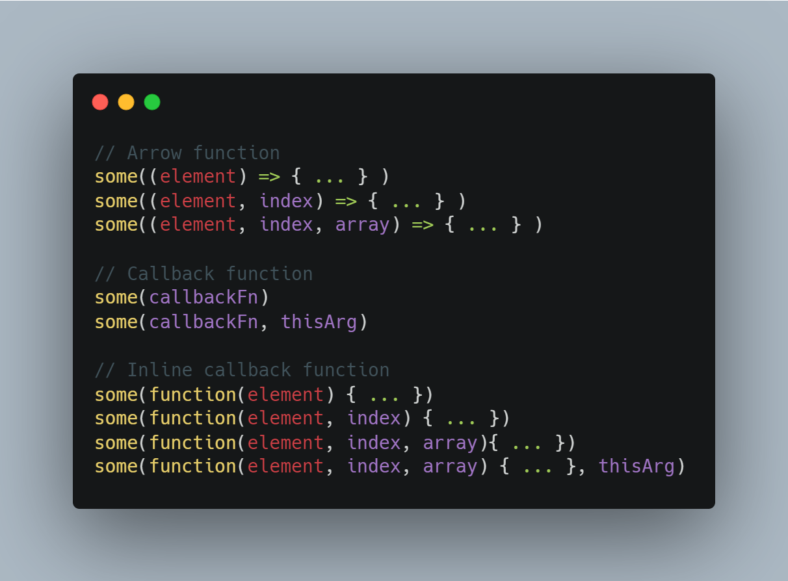
- Example:

    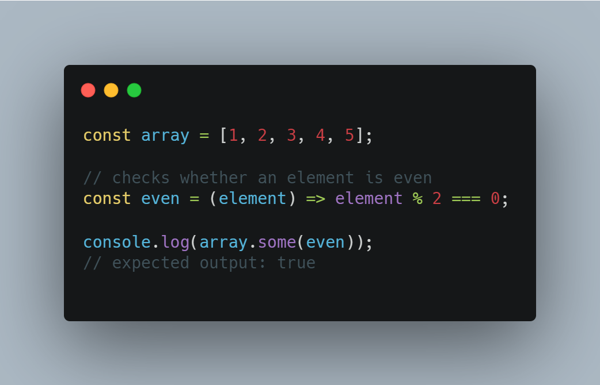

## .every()
- The **`every()`** method tests whether all elements in the array pass the test implemented by the provided function. It returns a Boolean value.

- Syntax :

    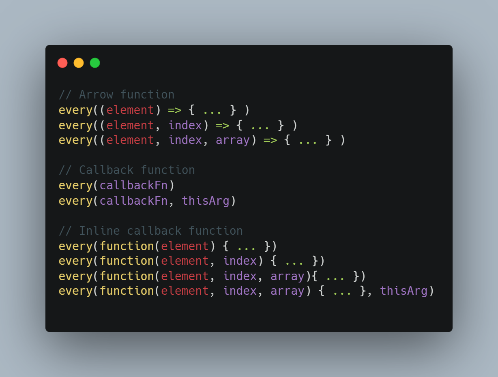

- Example :

    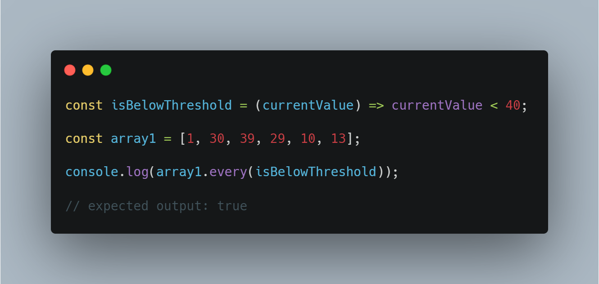

## .find()
- The **`find()`** method returns the value of the first element in the provided array that satisfies the provided testing function. 
- If no values satisfy the testing function, undefined is returned.
- Syntax :

    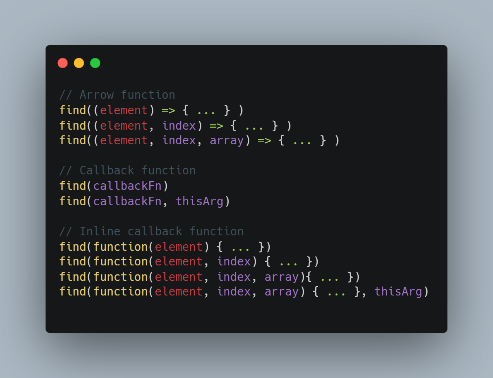
- Example :

    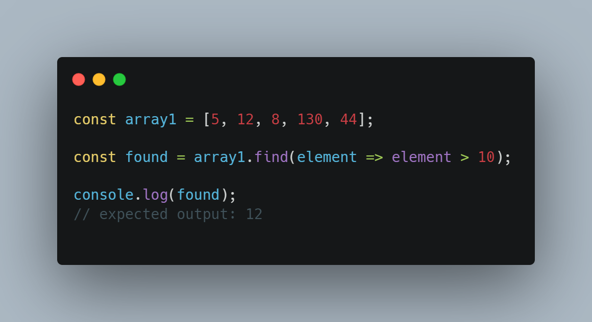

## .findIndex()
- The **`findIndex()`** method returns the index of the first element in the array that satisfies the provided testing function. 
- Otherwise, it returns -1, indicating that no element passed the test.
- Syntax :

    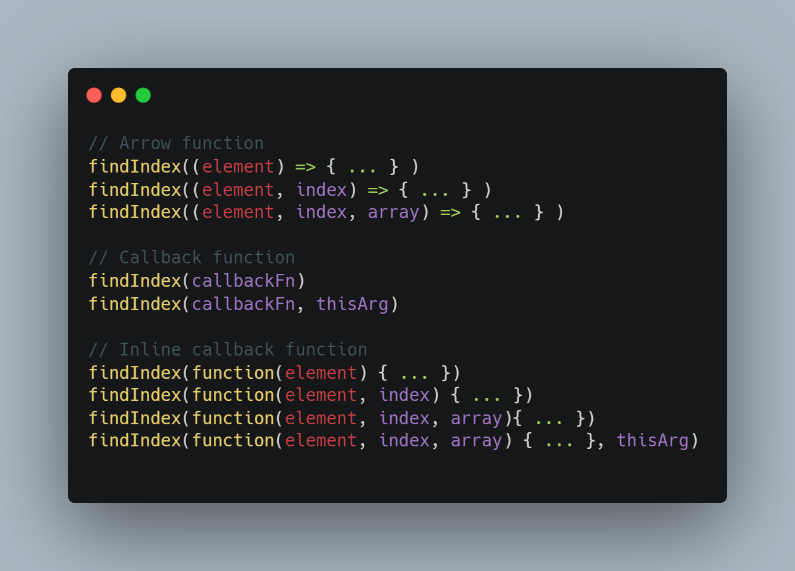
- Example :

    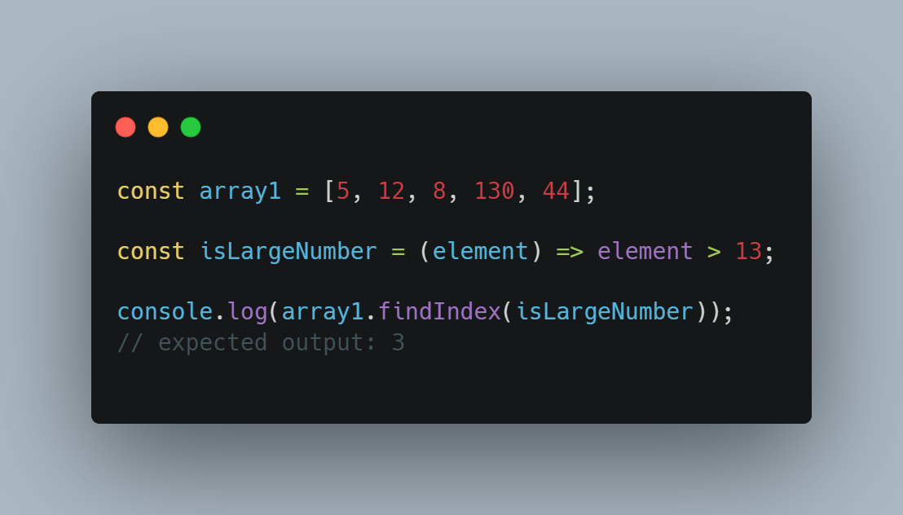

## .splice()
- The **`splice()`** method changes the contents of an array by removing or replacing existing elements and/or adding new elements in place. 
- Syntax :

    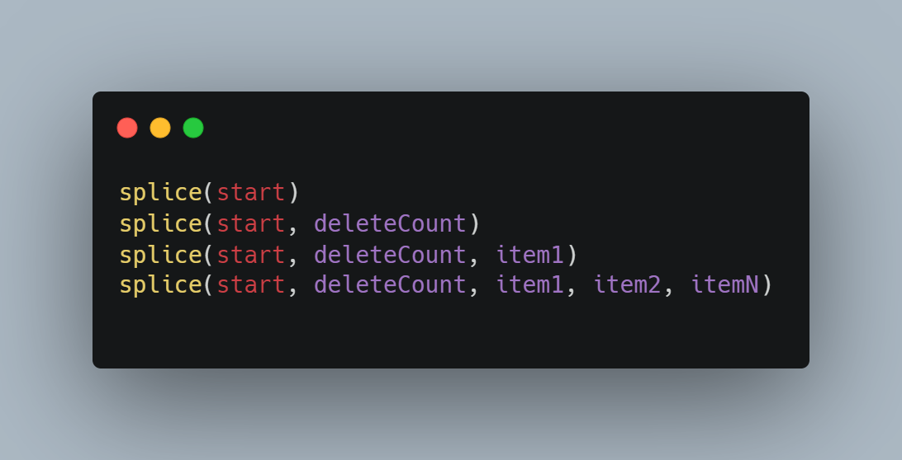
- Example :

    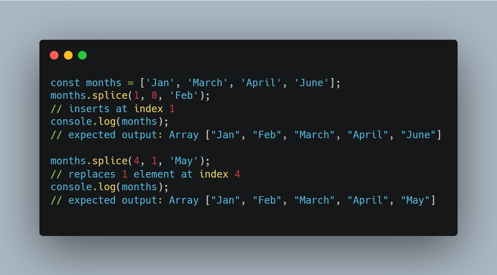

## .slice()

- The **`slice()`** method returns a shallow copy of a portion of an array into a new array object selected from start to end (end not included) where start and end represent the index of items in that array. The original array will not be modified.
- Syntax:

    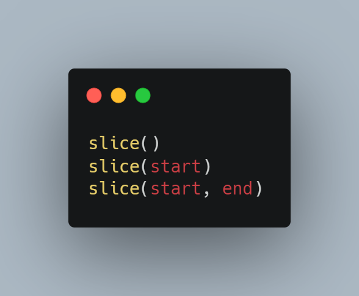
- Example:

    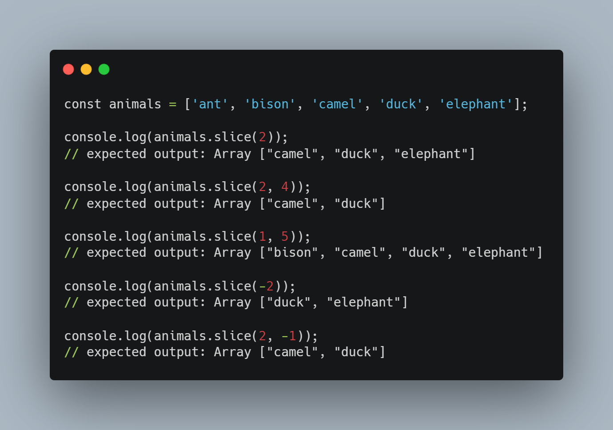

## Know more
[findIndex](https://developer.mozilla.org/en-US/docs/Web/JavaScript/Reference/Global_Objects/Array/findIndex)

[find](https://developer.mozilla.org/en-US/docs/Web/JavaScript/Reference/Global_Objects/Array/find)

[some](https://developer.mozilla.org/en-US/docs/Web/JavaScript/Reference/Global_Objects/Array/some)

[slice](https://developer.mozilla.org/en-US/docs/Web/JavaScript/Reference/Global_Objects/Array/slice)

[every](https://developer.mozilla.org/en-US/docs/Web/JavaScript/Reference/Global_Objects/Array/every)

[splice](https://developer.mozilla.org/en-US/docs/Web/JavaScript/Reference/Global_Objects/Array/splice)
