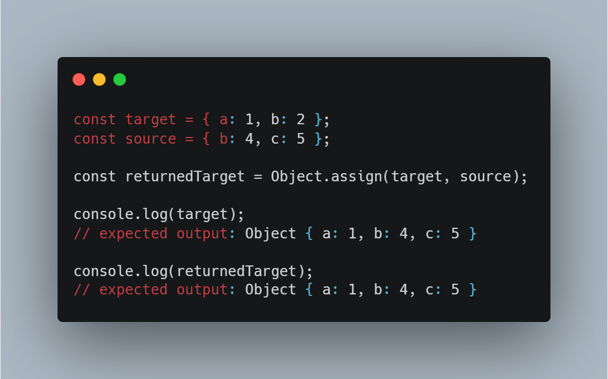
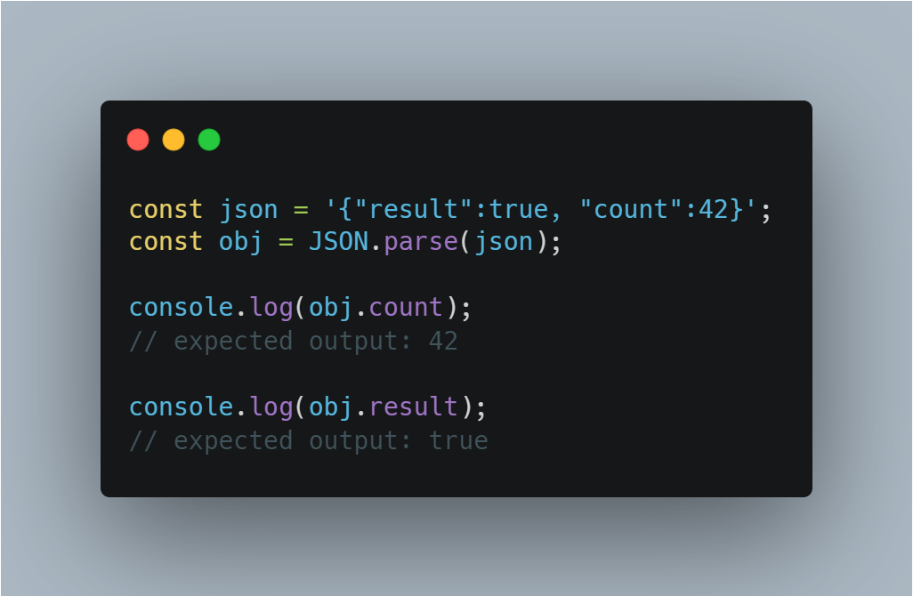
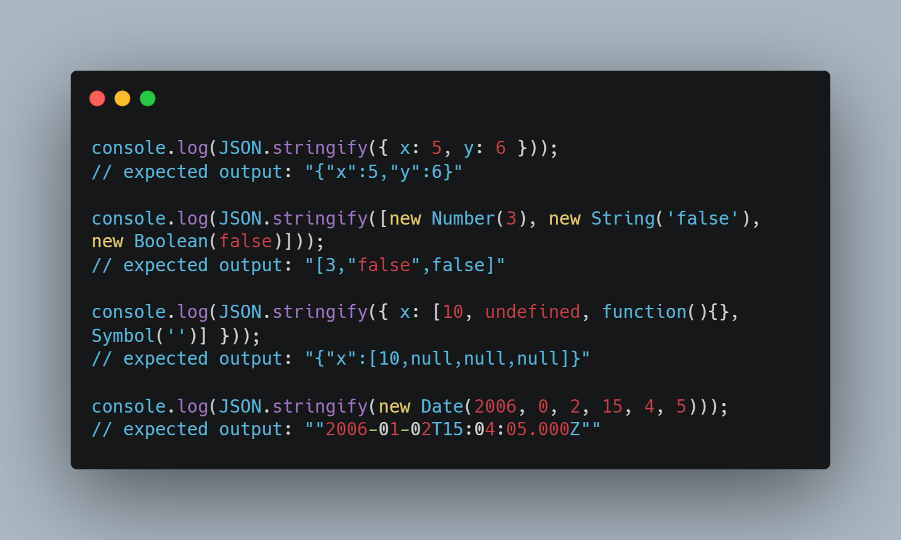

# 14 - Object and Arrays-Reference Vs Copy

## Object.assign 
- The Object.assign() method copies all enumerable own properties from one or more source objects to a target object. It returns the modified target object.

- Syntax :
    ```
    Object.assign(target, ...sources)
    ```

- Example :

    


## Object spread 
- Spread syntax (...) allows an iterable such as an array expression or string to be expanded in places where zero or more arguments (for function calls) or elements (for array literals) are expected, or an object expression to be expanded in places where zero or more key-value pairs (for object literals) are expected.
- Syntax : 
    ```
    let objClone = { ...obj }; // pass all key:value pairs from an object
    ```


## JSON.parse
- The JSON.parse() method parses a JSON string, constructing the JavaScript value or object described by the string. 
- An optional reviver function can be provided to perform a transformation on the resulting object before it is returned.
- Syntax :
    ```
    JSON.parse(text)
    JSON.parse(text, reviver)
    ```
- Example :

    


## JSON.stringify
- The JSON.stringify() method converts a JavaScript object or value to a JSON string, optionally replacing values if a replacer function is specified or optionally including only the specified properties if a replacer array is specified.

- Syntax :
    ```
    JSON.stringify(value)
    JSON.stringify(value, replacer)
    JSON.stringify(value, replacer, space)
    ```
- Example :

    


## Know more

[JSON.stringfy](https://developer.mozilla.org/en-US/docs/Web/JavaScript/Reference/Global_Objects/JSON/stringify)

[Object.assign](https://developer.mozilla.org/en-US/docs/Web/JavaScript/Reference/Global_Objects/Object/assign)

[JSON.parse](https://developer.mozilla.org/en-US/docs/Web/JavaScript/Reference/Global_Objects/JSON/parse)

[Spread](https://developer.mozilla.org/en-US/docs/Web/JavaScript/Reference/Operators/Spread_syntax)
