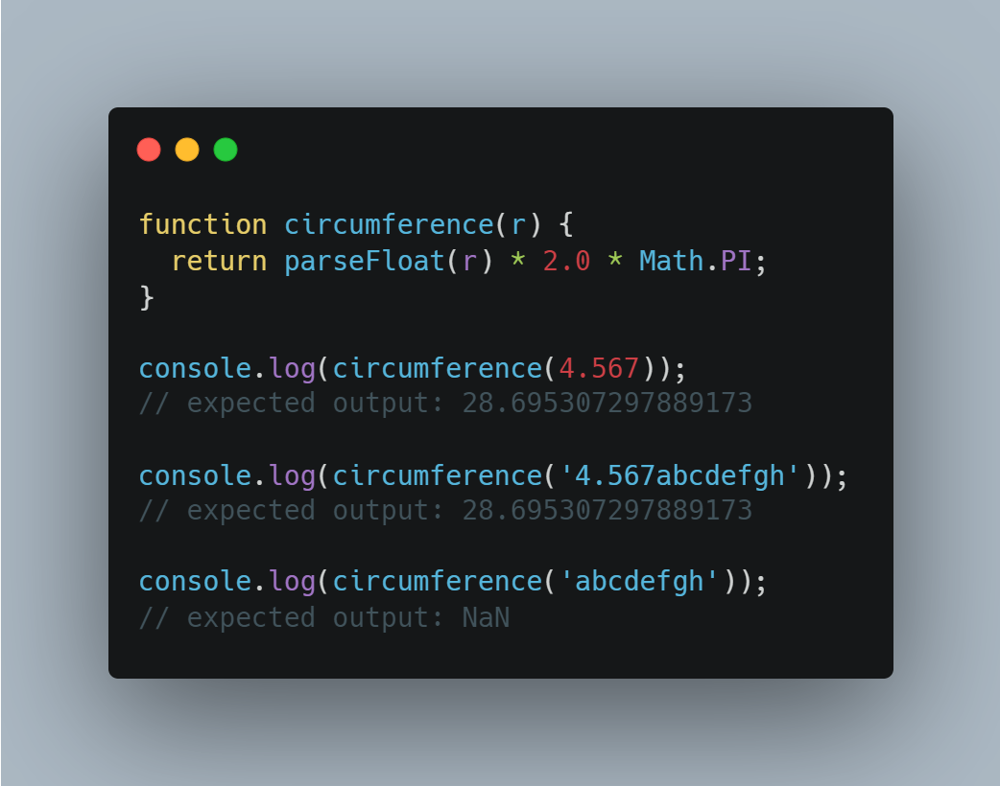

# 18 - Tally String times with Reduce

## parseFloat:
- The **`parseFloat()`** function parses an argument (converting it to a string first if needed) and returns a floating point number.

- Syntax:
    ```
    parseFloat(string)
    ```

- Example:

    

## Know more:
[parseFloat](https://developer.mozilla.org/en-US/docs/Web/JavaScript/Reference/Global_Objects/parseFloat)
